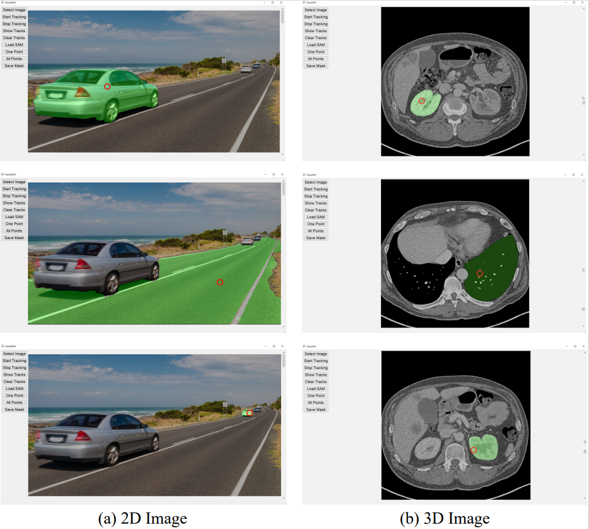

# GazeSAM: What You See is What You Segment


[Bin Wang](https://ukaukaaaa.github.io/), [Armstrong Aboah](https://aboah1994.github.io/), [Zheyuan Zhang](https://scholar.google.com/citations?user=lHtpCNcAAAAJ&hl=en), [Ulas Bagci](https://bagcilab.com/)

[[`Paper`](https://ai.facebook.com/research/publications/segment-anything/)] [[`Demo (Youtube)`](https://youtu.be/wRuhTUdXWEk)] [[`BibTeX`](#citing)]


The **GazeSAM** is a human-computer interaction system that combines eye tracking technology with Segment Anything Model (SAM), and it enables users to segment object they are looking at in real-time. This system is designed specifically for the radiologist to record segmentation mask during image reading by simply looking at the desired regions, which can boost the daily clinical workflow. Besides, eye-gaze data can also be easily recorded for the further eye-tracking research. This system supports both 2D and 3D images.


<div>
  <div style="display: flex; gap: 5px; flex-wrap: wrap;">
    
    
  </div>


  <div style="display: flex; gap: 5px;">
    
    
  </div>

  <div style="display: flex; gap: 35px;">
      
       
  </div>
</div>


A user interface is provided as shown in the left image above and experiment setting is illustrated as the right image above.


## Installation

This code requires requires `python=3.8.0`, as well as `pytorch>=1.7` and `torchvision>=0.8`. For your convenience, we already install the package of segment-anything in our repo but you still need to install some dependencies.

```
pip install opencv-python pycocotools matplotlib onnxruntime onnx
```

Besides, you need to download the model checkpoint provided by SAM as follows

- **`default` or `vit_h`: [ViT-H SAM model.](https://dl.fbaipublicfiles.com/segment_anything/sam_vit_h_4b8939.pth)**
- `vit_l`: [ViT-L SAM model.](https://dl.fbaipublicfiles.com/segment_anything/sam_vit_l_0b3195.pth)
- `vit_b`: [ViT-B SAM model.](https://dl.fbaipublicfiles.com/segment_anything/sam_vit_b_01ec64.pth)

And put the checkpoint under "./model/".

## <a name="GettingStarted"></a>Getting Started
In this work, we use Tobii Pro Nano as the eye tracker. If you have the device and want to repeat our result. Here is some steps you need to do.

First, download [Tobii Pro Eye Tracker Manager](https://connect.tobii.com/s/etm-downloads?language=en_US), then open the open it to install one Tobii Pro Nano device in your PC. After that, finish the calibration procedure to make sure the eye movement is recorded accurately.

Second, install some dependencies
```
pip install tobii-research, PyQt5, SimpleITK
```

Run the user interface by
```
python ui.py
```


## Visualization
Here is few examples of GazeSAM.




<!-- ## License

The model is licensed under the [Apache 2.0 license](LICENSE). -->


## Citing

```
@article{kirillov2023segany,
  title={Segment Anything},
  author={Kirillov, Alexander and Mintun, Eric and Ravi, Nikhila and Mao, Hanzi and Rolland, Chloe and Gustafson, Laura and Xiao, Tete and Whitehead, Spencer and Berg, Alexander C. and Lo, Wan-Yen and Doll{\'a}r, Piotr and Girshick, Ross},
  journal={arXiv:2304.02643},
  year={2023}
}
```